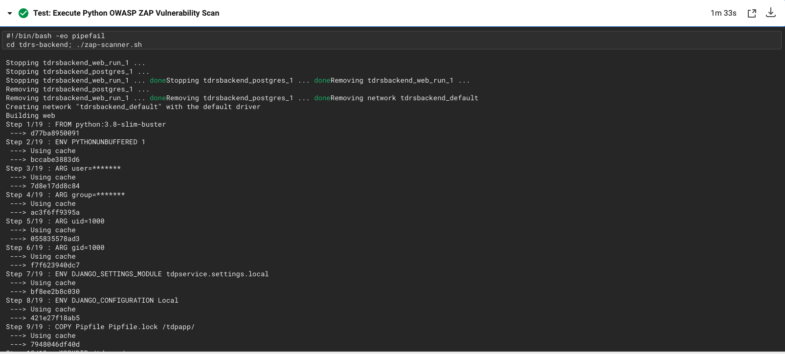

# Risk Assessment
## RA-05 - Vulnerability Scannings

a. Monitor and scan for vulnerabilities in the system and hosted applications [per the frequency defined in the HHS Policy for Vulnerability Management or ACF policy] and when new vulnerabilities potentially affecting the system are identified and reported;

b. Employ vulnerability monitoring tools and techniques that facilitate interoperability among tools and automate parts of the vulnerability management process by using standards for:

1. Enumerating platforms, software flaws, and improper configurations;
2. Formatting checklists and test procedures; and
3. Measuring vulnerability impact;

c. Analyze vulnerability scan reports and results from vulnerability monitoring;

d. Remediate legitimate vulnerabilities [per HHS Standard for Plan of Action and Milestones (POAM) Management and Reporting or ACF policies] in accordance with an organizational assessment of risk;

e. Share information obtained from the vulnerability monitoring process and control assessments with [ACF-defined personnel or roles] to help eliminate similar vulnerabilities in other systems; and

f. Employ vulnerability monitoring tools that include the capability to readily update the vulnerabilities to be scanned.

### OPS Implementation

a. As part of the OPS Test Plan, security scans are completed on an ongoing basis, throughout the Continuous Integration (CI).  Automated scans are run on every push, pull request, and merge on GitHub.

b. Security scanning is completed using OWASP ZAP dynamic security scans and Dependabot vulnerability dependency scanning.  Dependabot will automatically open Pull Requests if there is a vulnerability dependency.  If there are no findings, no Pull Requests will be opened.  OWASP Zap scans are the last step for each CI run.  The results for the scans are summarized and accessed through _____ TODO.  If vulnerabilities are found in the scan results, the code will be prevented from being deployed until the vulnerabilities are remediated.

c. Summaries of the security scan reports are reviewed in GitHub. (see screenshot of summaries of scan reports below)

d. Summaries of the security scan reports are available in GitHub.  If there are any vulnerability dependencies found by Dependabot, pull requests are automatically opened.  These pull requests are reviewed and remediated as necessary.

e. Information from the scan reports and control assessments are shared with the appropriate security stakeholders and are available for review in GitHub (TODO - ADD LINK).

### Control Orgination:

Hybrid with IaaS provider, ACF Tech, and OPS

### Related Content

HHS/ACF needs to have a documented process for vulnerability scanning with identified roles and responsibilities, incorporating appropriate federal oversight and separation of duties.
